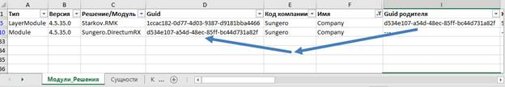

# Анализ метаданных разработки – плагин для DirectumLauncher

В жизни разработчика встречаются ситуации, когда возможностей среды разработки не хватает:

1.       Хочется отслеживать цепочку перекрытий
2.       Конфликт гуидов сущностей из-за перекрытия абстрактных типов (DDS 4.5 научилась с этим справляться, но до неё еще доконвертировать надо)
3.       Конфликт при мерже веток, особенно если ветка была «долгоиграющая» и в основной ветке накопились изменения
4.       Сложная разработка с несколькими командами, возможно из разных организаций
5.       Пишем SQL запрос для доступа к данным
6.       Хочется автоматизировать сборку пакетов разработки
7.       Хочется автоматизировать часть тестирования, но необходимая информация в среде разработке просто отсутствует на виду, а учить хорошего фронтендера разбираться в среде разработки и mtd файлах – может не надо?

Решением всех этих проблем будет анализировать метаданные из .mtd файлов. Да, эти задачи не возникают каждый день, но каждый раз, когда с этим приходится сталкиваться – уходит много времени.

## Решение – автоматизированный анализ прикладной разработки

Представляю Вашему вниманию уникальную разработку – плагин для DirectumLauncher (_нижайший поклон разработчикам этого чуда!_), который позволяет в одну команду получить на выходе из исходных кодов красивый и замечательный Excel файл, в котором есть достаточно информации для любого анализа.

[**https://github.com/STARKOV-Group/MTDAnalyze**](https://github.com/STARKOV-Group/MTDAnalyze)

**Как это работает?**

Плагин устанавливается в одну команду, содержит набор Python скриптов, который берёт из config.yml пути до репозиториев с разработкой [[ПЕ(1]](#_msocom_1) [[ПАВ2]](#_msocom_2) и проходит по всем найденным mtd файлам, собирая информацию о системе, а после сохраняет всё в Excel файл. Обрабатываются файлы, физически размещенные в данный момент в каталогах**, клонирование репозитория и переключение между ветками – не производится**. Вся логика вызывается через уже привычный **do.****bat**.

Процедура установки – положить архив плагина в каталог DirectumLauncher и выполнить команду для установки плагина:  
**do.****bat components add sgmtd**

**Использование сводится к двум командам:**

1. Генерация отчета:  
`do.bat sgmtd save_mtd_info ИМЯ_ФАЙЛА.xlsx`  
После запуска в текущем каталоге появится Excel файл, в котором есть информация о текущих и архивных цепочках перекрытий, сводная информация обо всех модулях и решениях.

2. Генерация файла для автосборки:  
`do.bat sgmtd gen_package package.xml`  
Появится xml файл, который обычно DDS генерирует при сборке пакета. Он используется в качестве шаблона для автосборки.

Удаление плагина:  
`do.bat components delete sgmtd`

## Совместимость со старыми версиями

Для обладателей старых версий RX, без DirectumLauncher, есть возможность запускать скрипт напрямую, но потребуется скачать и установить достаточно [Python](https://www.python.org/downloads/) (тестировалось с версией 3.10. будет работать и в более поздних).

1. Сгенерировать `package.xml` для DevelopmentStudio, пример команды (запускать из командной строки, в каталоге с mtd.py), в командной строке перечислить тип и пути до репозиториев:
`python mtd.py gen_package package.xml Base=c:\GIT\Base "Base=c:\Git\Space Path" Work=C:\Git\Work`

2. Сгенерировать Excel файл с метаданными разработки:
`python mtd.py save_mtd_info filename.xlsx Base=c:\GIT\Base "Base=c:\Git\Space Path" Work=C:\Git\Work`

Потребуется в явном виде указывать пути до репозиториев. Формат описания - **Base|Work** - тип, а после знака "=" полный путь до каталога репозитория, при этом если путь включает пробелы, то весь параметр заключается в кавычки.

## Примеры использования

### Отслеживание цепочки перекрытий
Во всех ключевых местах есть столбец **Guid** для сущности и **Guid родителя**, по ним можно найти все взаимосвязи с помощью автофильтров и поиска в Excel.

[

Для просмотра цепочки перекрытия сущностей (справочники, документы, задачи, задания) есть дополнительная вкладка «Перекрытия». Пример:

Можно отфильтровать по имени нужную сущность, по столбцам будут добавлены все родители, в данный момент заголовки столбцов предусматривают до 10 родителей, но на деле будет выводиться любая глубина вложенности.

Если для GUID родителя нет MTD файла (пример – Entity), то цепочка обрывается и в ячейку записывается только GUID родителя.

**Внимание**: *анализ производится только по данным, которые есть в MTD файлах. При этом **Development Studio** в зависимости от версии платформы строит цепочку динамически и несколько иначе.*

Например – если перекрыт OfficialDocument и OutgoingLetter, то в среде разработки будет цепочка:  
Solution.OutgoingLetter ->  
Docflow.OutgoingDocumentBase ->**Solution.OfficialDocument** ->**Docflow.OfficialDocument** ->  
030d8d67-9b94-4f0d-bcc6-691016eb70f3  

А утилита покажет такой вариант:  
Solution.OutgoingLetter ->  
Docflow.OutgoingDocumentBase ->  
**Docflow.OfficialDocument** ->  
030d8d67-9b94-4f0d-bcc6-691016eb70f3

Этого при первичном рассмотрении достаточно для быстрого понимания происходящего в системе, но в дальнейшем потребуется смотреть уже более детально в среде разработки.

### Решение конфликтов при конвертации на новую версию

В версиях до Directum RX 4.5 в случае наличия в разработке перекрытого абстрактного типа документа при публикации на сервере могут возникать ошибки вида:  
1. Не удалось разрешить зависимость модуля starkov.Module (v.0.0.1) от базовой сущности 58cca102-1e97-4f07-b6ac-fd866a8b7cb1. (это был Guid OfficialDocument)
2. У абстрактной сущности ApprovalRoleBase(3445f357-1435-4444-9f24-a56a752fc471) есть перекрытие ApprovalRoleBase(ec052b93-d570-4699-89eb-2c16bf8c62a2) и более одного наследника.
Общая причина: при конвертации отрабатывают скрипты для промежуточных версий из каталогов VersionData, либо есть противоречивые ссылки на родительские сущности. Проблема в том, что в разработке одна цепочка перекрытий, а в исторических данных другая цепочка.
Покажем на примере перекрытого в Solution OfficialDocument, при конвертации с версии 4.1.2 до 4.4.5.
Исходная цепочка была:  
Docflow.OutgoingLetter -> Docflow.OutgoingDocumentBase -> Docflow.OfficialDocument

С учетом перекрытия:  
Docflow.OutgoingLetter -> Docflow.OutgoingDocumentBase -> **Solution.OfficialDocument** -> Docflow.OfficialDocument

При этом возникает конфликт - есть перекрытая цепочка в разработке и есть исходная в исторических данных и опубликованная на сервере. Следует привести исторические данные в соответствие с разработкой на сервере для того, чтобы получилось корректно построить цепочку перекрытия для промежуточных версий.

В этом случае требуется отредактировать MTD файлы в VersionData, чтобы привести исторические данные в соответствие текущим. Для этого требуется найти все вхождения исходного BaseGuid OfficialDocument и отредактировать на NameGuid перекрытого.

**Алгоритм действий**:  
1. Выяснить и зафиксировать Guid-ы всех участников процесса. Это делается на вкладках «**Сущности**» по столбцам **«****Guid»** и «**Guid родителя».** Следует пройти по шагам всю цепочку от итогового перекрытия до исходного**.  
**

Или на вкладке «**Перекрытия**» (*следует учесть, что Development Studio в рантайме рассчитывает цепочку перекрытий несколько иначе*):

2. Определить затронутые архивные версии (выделил желтым)

3. Отредактировать в MTD файлах параметр BaseGuid для затронутых архивных версий со значения **58cca102-1e97-4f07-b6ac-fd866a8b7cb1** (DirectumRX.Docflow.OfficialDocument) на перекрытый Guid **2fda4f44-1f7c-450c-8670-0095c2d148b2** (Solution.OfficialDocument).

Благодаря утилите можно невооруженным взглядом, не перебирая все VersionData файлы, увидеть отклонения в столбцах **Guid,** **ParentGuid** и заодно быстро найти – в каких файлах потребуется поправить цепочку Guid’ов.

### Решение конфликта при слиянии веток 
Иногда сталкиваются доработки из разных веток, когда в пределах одной сущности два разработчика в разных ветках редактировали и добавляли свойства или контролы на форму.
В Development Studio Directum RX 4.6 появился новый механизм авторазрешения конфликтов при слиянии веток.
К сожалению, в более старых версиях такого нет, поэтому иногда приходится вмешиваться вручную. Причем проблема заключается в том, что основные конфликты будут вокруг Guid’ов, для которых не всегда рядом есть человекочитаемые названия.

Возможное решение - для двух веток репозитория сгенерировать по Excel файлу, расположить их рядом и поглядывая на вкладку «**Свойства**» или **«Контролы»** начинать вручную устранять конфликты (_а_ _потом не забыть наладить процессы совместной разработки в соответствии с рекомендациями_ _Directum_).

### Просмотр изменений в сложной разработке с несколькими подрядчиками
На одном большом проекте Заказчик докупил дополнительное решение у другого партнёра. Учитывая объемы разработок, было решено, что решение партнёра будет добавлено к нам на базовый слой. Проблемой было, что почти все карточки документов были очень серьёзно переработаны. Ну и бонусом – в наших перекрытиях не использовались контролы предка:

Задача – с минимумом трудозатрат выявить в чужой разработке новые контролы на форме, чтобы вынести их вручную в наших перекрытых сущностях. Решение – на вкладке «**Контролы**» выбираем нужную сущность, а дальше всё отлично видно – любой контрол, который был затронут в нужном базовом слое – попадает в .mtd файл. Дальше остаётся только работа мышкой по добавлению контролов на форму.

Аналогично можно быстро оценить изменения, добавленные в сущность на каком-то из слоёв – выбираем на вкладке «Свойства» нужную сущность, фильтруем по коду компании и модулю – видим все затронутые свойства, например – что было добавлено/изменено в справочнике «**ConstantsEntity**» компанией **finex**:

### Помощь в написании SQL запроса для доступа к данным 
Иногда для построения сложных отчетов требуется писать более оптимизированные запросы, чем позволяет сделать объектная модель. С одной стороны в справке всё есть, с другой стороны хочется большего комфорта.

Цитата из справки:

Специально для этого добавлены дополнительные столбцы на вкладках «**Сущности**» (**SQL таблица**).

Для свойств собственная вкладка «**Свойства**» (**SQL столбец**).

Пример ситуации – в RX 3.6 потребовалось добавить в каждый тип документа поле, которое в дальнейшем потребовалось использовать в сложных отчетах. Когда перед глазами ключевая часть имени столбца, остальное дописывает уже автодополнение среды разработки, что ускоряет процесс.
_Есть возможность генерировать названия столбцов целиком, но пока сложность с коллекциями, решение еще будет развиваться._

### Генерация package.xml для автосборки
`do.bat sgmtd gen_package package.xml`

На выходе получаем файл, который можно использовать как шаблон для автосборки

### Подготовка данных для автотестов
Иногда на проектах хочется внедрить автоматическое UI тестирование, а в случае больших длящихся проектов еще и возрастает ценность регрессионных тестов.
В данный момент нет готового ответа на этот вопрос, но есть некоторые идеи, которые будут развиваться.
Можно написать сценарий, по которому браузер самостоятельно выполнит все необходимые подготовительные действия или даже проведёт полный цикл проверки, например - что функциональность **(всё еще)** работает ожидаемым образом. Проблема – для однозначного «прицеливания» в нужные контролы требуется использовать поиск контрола не по тексту, а по более уникальным признакам. К счастью, они есть – каждый контрол и кнопка на форме обладают уникальным Guid’ом (_это_ _не относится к коллекциям_), проблема - в среде разработки вообще нет такой информации, всё как обычно можно найти в mtd файлах.
Идеальным решением проблемы будет – написать максимально удобную обвязку для UI тестов, чтобы даже консультант после непродолжительного обучения смог чуть ли не мышкой натыкать необходимый сценарий проверки.
Одним из элементов этого пути будет удобная табличка в Excel-е, в которой будет вся необходимая информация, только бери и пользуйся. Но тут следующая проблема – при активной разработке эта информация будет устаревать, поэтому надо снизить трудозатраты на обновление этого Excel файла.
И да, не забываем, что мы внедряем типовое решение и кастомизируем его, а не пишем платформу, так что суммарные трудозатраты на все подготовительные действия должны быть как можно меньше.

**Чем можно помочь уже сейчас разработчику автотестов?**
1. Текущий адрес сущности и сама сущность

2. Кнопка на ленте, вид в системе, HTML-тэг и как выглядит в Excel:

3. Контрол на форме, вид в системе, HTML-тэг и как выглядит в Excel:

4. Коллекции – пока только в планах.

## Планы развития
1. Решить проблему со свойствами и контролами, которые были добавлены в сущностях за пределами среды разработки (ElectronicDocument, DataBook, Task, Assignment) – они не попадают в выгрузку, потому что их нет и в GIT репозиториях. В данный момент промежуточное решение – подготовить набор mtd файлов для базовых сущностей – ElectronicDocument, Task, Assignment и добавлять их к анализу. Сейчас утилита ищет каталог «**_platform**» в каталоге с остальными репозиториями, если он есть – подгружает из него базовую информацию.
2. Отрефакторить всё вокруг коллекций, они по структуре не отличаются от обычных справочников и это усложняет часть логики вычислений (имена таблиц, столбцов)
3. Доработать импорт локализации. Пока подгружается только для модулей и документов/справочников/заданий/задач, а свойства и действия еще не охвачены.
4. Добавить графическое отображение цепочек наследований и перекрытий, как в статье моего коллеги [https://club.directum.ru/post/346761](https://club.directum.ru/post/346761) , только с максимальной автоматизацией, а не сборка вручную.
5. Развить направление UI автотестов, чтобы снять часть типовых проверок с разработчиков и консультантов.

**Где всё это попробовать?**  
[**https://github.com/STARKOV-Group/MTDAnalyze**](https://github.com/STARKOV-Group/MTDAnalyze)
